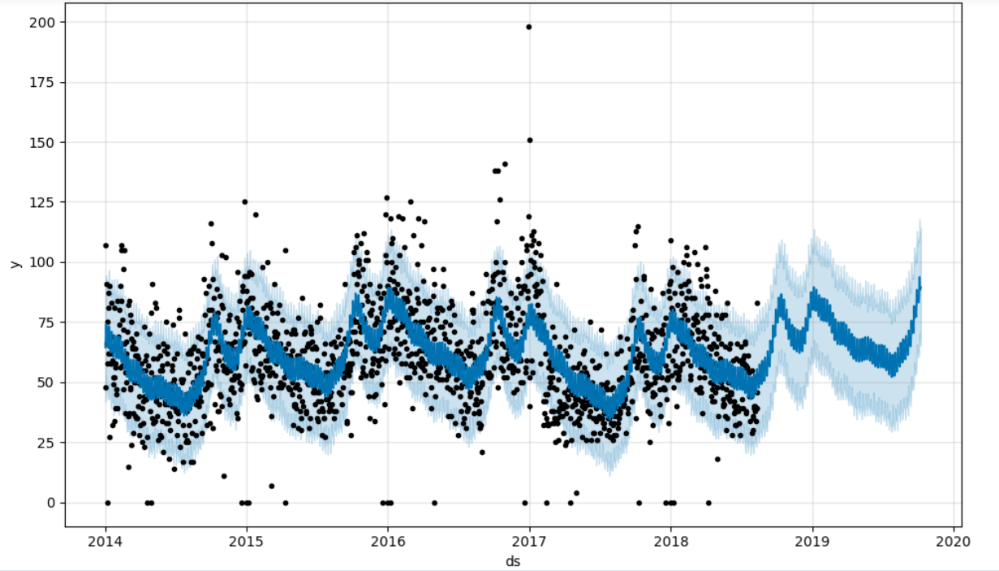
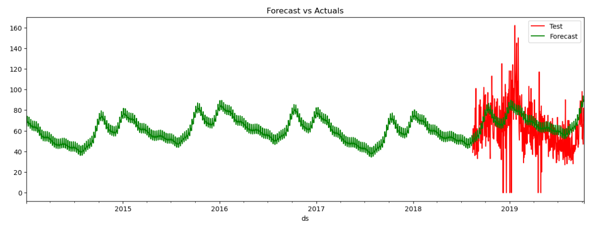

# Dokumentation FBProphet

## Einleitung

Das Hauptziel dieser Aufgabe war es, eine Methode zu finden, um signifikante Abweichungen und Muster in einem Zeitstrahl zu erkennen. Diese Daten sollten später in einer Salesforce-Monitoring-Umgebung integriert werden und auf ein spezifisch definiertes Fehlverhalten hinweisen.

Um zu messen, wie sehr ein Datenpunkt in ein System passt, habe ich mich entschieden, diesen vorherzusagen (Timeseries Forecasting) und mit dem real aufgetretenen Wert zu vergleichen. Das Signifikanzniveau könnte dann von Salesforce selbst bestimmt werden.

## Prophet
Nach einigen Versuchen mit ARIMA, SARIMA, Regression Trees und Random Forests entschied ich mich für eine bereits implementierte Mischung dieser Methoden, die Open-Source-Bibliothek FBProphet. In neueren Versionen wird sie nur noch als Paket Prophet benannt.

Da mir keine spezifischen Verkaufsdaten der Sachsenenergie zur Verfügung standen, habe ich von Kaggle einen Apotheken-Datensatz für bakterielle Medikamente heruntergeladen und diesen für die Analyse verwendet. Wichtig ist, dass diese Daten periodisch waren und eine saisonale Komponente enthielten, da ich vor allem diese testen wollte, weil die bereits genannten Methoden hier Schwächen zeigten.

Die finale Version ist in der Datei "Prophet_local.ipynb" zu finden. Die schwarzen Punkte stellen die echten Daten dar, das Hellblau die obere und untere Vorhersage und das Dunkelblau die approximierte Vorhersage selbst. Das Konfidenzintervall würde man also aus den hellblauen Flächen berechnen.

Anhand der nächsten Grafik kann man die Genauigkeit gut erkennen. Als Wert, an dem ich diese messe, habe ich MAE (Mean Absolute Error) verwendet.

In der Datei "Prophet_local_dropped_outliers.ipynb" habe ich die Ausreißer aus dem Datensatz entfernt und die Genauigkeit erneut gemessen. Die MAE war hier um 5 Einheiten kleiner. Ich habe mich aber entschieden, die Ausreißer nicht zu entfernen, da ich diese als wichtige Information für das Monitoring ansehe und das nicht dem Best Practice entspricht.

## Parameter festlegen
Man kann und sollte in Prophet einige datenspezifische Parameter festlegen, um die Genauigkeit des Modells zu erhöhen. Wichtige Parameter sind z. B. die Saisonalität, die Trendart, die Anzahl der Fourier-Terme und Feiertage. Ich habe all diese möglichen Parameter miteinander kreuzvalidiert und die Genauigkeit gemessen, welche um 1,5 Einheiten stieg.

Das Modell exportierte ich als .pickle-Datei, was sich später als Fehler herausstellte.

## Anwendung in Docker-Container hosten
Da ich das Modell in einer Salesforce-Umgebung verwenden wollte, habe ich es in einem Docker-Container gehostet. Dafür war das .pickle-Format problematisch, da es zum Entpacken dieses Formats auf alle Bibliotheken zugreifen muss, welche auch beim Erstellen von diesem verwendet wurden. Auf diese wollte ich aber im Container verzichten. Ich entschied mich daher für eine .json-Datei.

Um das Modell in einem Docker-Container zu hosten, habe ich eine Flask-API erstellt, welche das Modell lädt und auf Anfrage ein JSON-Objekt mit allen angeforderten Daten der Tage zurückgibt. Zuerst hatte ich auch eine kleine Anzeige bei index.html, wo man das Datum manuell anfordern konnte, was sehr schön zum Testen war. Bei der Fehlersuche in meinem Container entfernte ich diese aber wieder und blieb bei dieser Lösung. Den Docker-Container habe ich dann testweise in der Google Cloud gehostet und die API getestet.

## Nächste Schritte
API über Apex (Salesforce) testen.
Das Prophet-Modell auf Verkaufsdaten der Sachsenenergie anwenden und umstellen, damit die Zeitachse nicht mehr in Tagen, sondern in Stunden gemessen wird.
Die API um eine Funktion erweitern, um automatisch neue Verkaufsdaten zu laden und das Modell neu zu trainieren.
Die API auf der Cloud der Sachsenenergie hosten.
Ins Monitoring einbinden.
Optional nach weiteren Methoden suchen, um signifikante Abweichungen zu erkennen oder die MAE zu verringern.

Geschrieben von Lukas Kouba, jederzeit erreichbar unter lukas.kouba.de@gmail.com | +420 739 770 467